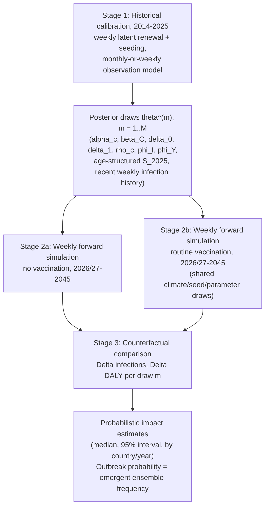
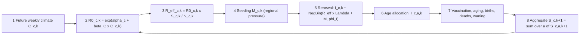

# Modelling the Impact of Routine Immunisation against Chikungunya across Latin American Countries: A Climate-Informed Semi-Mechanistic Stochastic Renewal State-Space Model

*Working proposal draft*

---

## 1. Overview

Chikungunya transmission across Latin America is shaped by two forces that operate on very
different time scales: fast, climate-modulated transmissibility within a season, and slow,
multi-year depletion and replenishment of the susceptible pool through infection, births, and
population turnover. This proposal describes a **climate-informed, semi-mechanistic stochastic
renewal state-space model** that couples these two processes to (i) reconstruct historical
transmission dynamics from surveillance data (2014–2025), and (ii) generate probabilistic,
climate-driven projections of future transmission (2026/2027–2045) under routine-immunisation
and no-vaccination scenarios, so that the population-level impact of a chikungunya vaccination
programme can be estimated as a counterfactual comparison between two coupled stochastic
futures.

Following methodological review, the model is refined and is now formally described as a:

> **Hierarchical, climate-informed stochastic renewal state-space model with dynamic
> age-structured susceptibility and exogenous seeding.**

The three additions relative to a plain renewal model — **hierarchical** pooling across
countries with unequal data, a **dynamic age structure** that is coupled to transmission at
every timestep rather than bolted on afterwards, and an explicit **seeding/importation** process
— are what make the model usable across a heterogeneous, mostly data-sparse set of countries
while still tracking who is protected and by what.

### 1.1 Why a stochastic renewal model (not constant-FOI, not full vector–host SEIR)

**Reason 1 — escaping the constant-FOI assumption.** The standard catalytic approach,

$$
P(\text{infected by age } a) = 1 - \exp(-\lambda a)
$$

assumes the same long-run average force of infection $\lambda$ acts every year. That is useful
for estimating long-run average immunity and burden, but it cannot represent the *episodic*
nature of chikungunya transmission: some years see almost no transmission, others see a large
outbreak, susceptibility is sharply depleted after an outbreak, and it is only slowly
replenished by births over subsequent years. Instead of imposing a constant annual force of
infection, this model generates each future epidemic trajectory from climate, susceptibility,
seeding, and stochastic transmission acting together. Under this structure, the outbreak
probability in a future year is not a pre-specified probability or the output of a separate
logistic-regression submodel — it is an **emergent property of the forward simulation ensemble**
(see §8):

$$
P(\text{outbreak in year } y) = \frac{\text{number of simulations exceeding the outbreak threshold in year } y}{M}
$$

FOI estimates from prior work are not discarded; they are simply repurposed. Rather than driving
future transmission directly, FOI/seroprevalence evidence is used only as (i) a prior on initial
immunity $S_{c,0}$, (ii) an anchor for cumulative post-outbreak infection, and (iii) auxiliary
information helping identify the reporting rate and the overall scale of infection.

**Reason 2 — tractability for sparse, multi-country data.** Fitting a full human–mosquito SEIR
model separately to each country typically requires estimating mosquito density, biting rate,
mosquito mortality, extrinsic incubation period, human incubation/infectious duration, reporting,
and initial immunity. With monthly (or even weekly) case series alone, this parameter set is
essentially unidentifiable per country. The renewal model sits deliberately between the two
extremes:

> **Simpler than a full vector–host SEIR, but more mechanistic than a constant-FOI catalytic
> model or a purely statistical outbreak-occurrence regression.**

It keeps the essential causal structure — infections are generated from past infections,
susceptibility falls with infection and vaccination, climate modulates transmissibility, and
importation can restart transmission — while remaining fittable from the kind of surveillance
data that is actually available across Latin American countries.

Combining both reasons into one sentence:

> **Build the minimal semi-mechanistic transmission model that generates stochastic epidemic
> recurrence — rather than a constant long-run average FOI — while remaining fittable to the
> heterogeneous, often sparse, multi-country surveillance data actually available, without
> requiring a full vector–host SEIR fit per country.**

---

## 2. Objectives

**Primary objective.** Estimate the counterfactual reduction in chikungunya infections,
symptomatic cases, and disease burden (e.g. DALYs) attributable to routine immunisation across
Latin American countries between 2026/2027 and 2045, under uncertainty propagated from both
historical calibration and future climate and demographic trajectories.

**Secondary objectives**

1. Reconstruct country-level transmissibility ($R_{0}$, $R_{\text{eff}}$) and age-structured
   susceptibility trajectories for 2014–2025 from surveillance data and climate covariates.
2. Quantify how climate suitability modulates transmission potential across countries with
   heterogeneous epidemiological histories.
3. Generate probabilistic (ensemble) projections of outbreak timing, size, and recurrence under
   a no-vaccination baseline, with outbreak probability treated as an emergent ensemble outcome
   rather than a fitted parameter.
4. Compare routine-immunisation strategies (introduction age, coverage, catch-up) against the
   no-vaccination baseline using paired stochastic simulation, with age-specific vaccination
   coupled to transmission at every timestep.
5. Characterise which countries/parameters are data-calibrated versus prior-dominated, to
   prioritise future data collection.

---

## 3. Data Sources and Country Data Tiers

| Component | Source | Status |
|---|---|---|
| Multi-country introduction/outbreak-year history | `Data/chikungunya_intro_years_model_ready_updated.xlsx` (consumed by `country_specific_susceptible_model.R`) | Available — candidate source for country-level introduction timing and the regional-pressure seeding covariate (§5.6) |
| Multi-country FOI / seroprevalence posterior | `MainData/foi_comb_all_0707.RData` (`allfoi_s1.RData`) | Available (large, gitignored) — prior for initial/cumulative immunity, **not** a driver of future transmission (§1.1) |
| Country-specific susceptibility modelling | `country_specific_susceptible_model.R`, `country_specific_sus_graph.R` | Available |
| At-risk / focal population by country | `Data/global_all_atrisk.csv`, `Data/global_all_focal.csv` | Available |
| Age-stratified burden and infection estimation, PSA | `age_strat_burden_estim_atrisk.R`, `chikmap_psa_final.R` | Available — provides the severity/reporting cascade needed to convert $I_{c,k}$ into cases, hospitalisations, deaths, DALYs |
| Weekly/monthly case time series (needed to fit the renewal likelihood, §5) | Not currently in this repo; a monthly Brazil SINAN pipeline exists in the sibling `CHIK_CLIM` project | **To be acquired** for non-Brazil countries; Brazil can pilot the renewal fit using `CHIK_CLIM`'s existing SINAN extraction |
| Historical weekly/monthly climate covariates, by country | Not currently in this repo; `CHIK_CLIM` has Brazil-only municipal climate (TerraClimate/WorldClim) | **To be acquired/extended** to country level |
| Future climate projections (CMIP6) | Not currently in this repo; `CHIK_CLIM` has a Brazil-scoped WorldClim CMIP6 fetch | **To be acquired/extended** to country level |
| Cross-border mobility/adjacency weights (for the seeding covariate, §5.6) | Not currently in this repo | **To be defined**; start with a simple distance/adjacency proxy, refine later |
| Vaccination coverage, schedule, efficacy, waning | Programme assumptions / trial data | **To be defined** per scenario; efficacy and waning priors to be sourced from published vaccine trial data once a product/schedule is specified |

**Countries are not treated uniformly.** How a country enters the model depends on what data it
actually has, using three explicit tiers rather than a single blanket "hierarchical prior"
statement:

| Tier | Data available | Analysis |
|---|---|---|
| 1 | Weekly/monthly case series **and** serology | Direct calibration of $\alpha_c$ and country-specific latent trajectories from that country's own likelihood |
| 2 | Monthly case series, limited/no serology | Hierarchical calibration — $\alpha_c$ is data-informed but partially pooled toward the regional mean; wider uncertainty |
| 3 | No usable case time series | **Not calibrated.** $\alpha_c$ is transferred from the regional posterior, climate suitability, and the FOI/serology/country-covariate evidence in this repo. This is a prior-predictive projection, not a fitted country model |

Every output table and figure should carry a visible Tier label (or explicit
data-informed / partially-pooled / prior-dominated flag) so that Tier-3 projections are never
read as if they were fitted to that country's own surveillance data.

---

## 4. Model Structure at a Glance

The pipeline has three stages: (1) fit the model to historical case counts to obtain a joint
posterior over transmission, seeding, and 2025 age-structured latent states; (2) roll that
posterior forward, week by week, under two scenarios that share every source of external
randomness except vaccination; (3) difference the two scenario ensembles, draw by draw, to
obtain the vaccine-attributable impact.

---

## 5. Stage 1 — Historical Calibration (2014–2025)

### 5.1 Time structure: weekly latent process, monthly-or-weekly observation

Chikungunya's generation interval is concentrated around 3–4 weeks (§13). A monthly timestep is
too coarse to represent transmission directly, since several transmission "generations" can
occur within a single month. The latent transmission process therefore runs **weekly** (index
$k$), while the observation model connects it to whatever reporting resolution a given country
actually has — weekly or, more commonly, monthly (index $m$, a set of consecutive weeks). This
means a country with only monthly case counts is not excluded from a mechanistically consistent
weekly renewal process: its weekly infections are simply less precisely observed, which shows up
as wider uncertainty on the recovered weekly trajectory, not as a cruder model.

### 5.2 Transmission model

Country-specific baseline transmissibility $\alpha_c$ and a shared climate effect $\beta_C$
determine the weekly basic reproduction number:

$$
R_{0,c,k} = \exp\left(\alpha_c + \beta_C\, C_{c,k}\right)
$$

Susceptible depletion scales this down to an effective reproduction number:

$$
R_{\text{eff},c,k} = R_{0,c,k}\, \frac{S_{c,k}}{N_{c,k}}
$$

where $S_{c,k} = \sum_a S_{c,a,k}$ is the aggregate latent susceptible population (rolled up
from the age-structured states, §5.4/§7) and $N_{c,k}$ the total population.

### 5.3 Generation-interval kernel

New infections are generated from a weighted sum of infections in the preceding weeks,
$\Lambda_{c,k} = \sum_{g=1}^{5} w_g\, I_{c,k-g}$, using generation-interval weights $w_g$ fixed
from the published CHIKV literature (not re-estimated from the case data itself; see §13 for the
derivation and sensitivity-analysis alternatives):

| Weeks before current infection | $w_g$ | Contribution |
|---|---:|---:|
| 1 | 0.011 | 1.1% |
| 2 | 0.187 | 18.7% |
| 3 | 0.432 | 43.2% |
| 4 | 0.287 | 28.7% |
| 5 | 0.083 | 8.3% |

$$
\Lambda_{c,k} = 0.011\, I_{c,k-1} + 0.187\, I_{c,k-2} + 0.432\, I_{c,k-3} + 0.287\, I_{c,k-4} + 0.083\, I_{c,k-5}
$$

About 72% of current transmission pressure comes from infections 3–4 weeks earlier, consistent
with CHIKV TSIR studies finding that case counts 3–4 weeks prior are the strongest predictor of
current case counts (§13).

### 5.4 Renewal (latent infection) process, including seeding

Unlike a version that only adds importation in the future projection, **seeding is part of the
historical likelihood as well**:

$$
I_{c,k} \sim \text{NegBin}\left(R_{\text{eff},c,k}\, \Lambda_{c,k} + M_{c,k},\ \phi_I\right)
$$

This is necessary because once infections fall to (or near) zero, $\Lambda_{c,k} \approx 0$ and
the renewal process cannot restart itself without an external introduction term $M_{c,k}$; a
model without seeding in the calibration period cannot explain how transmission resumes after a
period of apparent fade-out, which is exactly the recurrent pattern this model is meant to
capture. The seeding model itself is specified in §5.6.

$\phi_I$ is the **process** (transmission) overdispersion parameter, kept separate from the
**observation** overdispersion parameter $\phi_Y$ introduced next — these represent different
sources of stochasticity (epidemic/demographic noise in transmission vs. surveillance noise in
reporting) and should not share a single dispersion parameter.

### 5.5 Observation model

Reported cases in month $m$ (the set of weeks $k \in m$) are an overdispersed, downsampled
observation of the true weekly infections through a reporting rate $\rho_c$:

$$
Y_{c,m} \sim \text{NegBin}\left(\rho_c \sum_{k \in m} I_{c,k},\ \phi_Y\right)
$$

For the (few) countries with weekly-resolution surveillance, the same equation is used with $m$
replaced by a single week $k$.

### 5.6 Seeding / importation model

A minimal seeding model driven by regional transmission pressure:

$$
M_{c,k} \sim \text{Poisson}\left(\lambda_{c,k}\right), \qquad \log \lambda_{c,k} = \delta_0 + \delta_1\, A_{c,k}
$$

$$
A_{c,k} = \sum_{j \neq c} W_{j \to c}\, \frac{Y_{j,k}}{N_j}
$$

where $Y_{j,k}/N_j$ is the incidence of other, potentially source, countries/regions $j$, and
$W_{j \to c}$ is a weight reflecting distance, adjacency, or travel/mobility connectivity between
$j$ and $c$. Where observed imported-case data exist, they should be used directly in place of
this proxy.

**This is the single most uncertain and most consequential part of the model.** Future outbreak
*timing* is driven not only by climate and susceptibility but by *when* an introduction happens,
which the model cannot know in advance. For the MVP: use observed imported cases where available;
otherwise use the regional-incidence proxy above; for future simulation, either resample
historical regional-pressure patterns or run a joint regional simulation so that seeding in one
country is generated consistently with simulated incidence in its neighbours (rather than treated
as an independent random draw per country, which would understate correlated regional risk).

### 5.7 Priors and hierarchical pooling

$\alpha_c \sim \mathcal{N}(\mu_\alpha, \sigma_\alpha^2)$ across countries, with $\mu_\alpha,
\sigma_\alpha$ estimated jointly (partial pooling), applied according to the country tier defined
in §3: Tier-1 countries are dominated by their own likelihood; Tier-2 countries are pulled toward
the regional mean in proportion to how little data they contribute; Tier-3 countries carry no
country-specific likelihood at all and are placed entirely by the regional prior and external
covariates. $\beta_C$ is shared across countries (pooled climate effect), optionally with a
country-level random slope if the data support it.

Because monthly (or even weekly) case counts alone cannot simultaneously identify transmission,
reporting, initial susceptibility, and seeding, several quantities are constrained by informative
priors rather than estimated freely:

- Initial susceptible proportion $S_{c,0}/N_c$ — from the FOI/serology posterior (§3)
- Reporting rate $\rho_c$ — from published under-ascertainment evidence where available,
  otherwise a weakly informative prior shared across similar countries
- Seeding scale ($\delta_0, \delta_1$) — from historical introduction-timing data (§3) and
  plausibility bounds, since this is the least identifiable part of the model

Fitting this stage to 2014–2025 data yields a joint posterior over the parameters
$\alpha_c, \beta_C, \delta_0, \delta_1, \rho_c, \phi_I, \phi_Y$ and over every latent weekly
trajectory $I_{c,k}, S_{c,k}, R_{0,c,k}, R_{\text{eff},c,k}$ for $k$ spanning 2014–2025.

---

## 6. Transferring Posterior Uncertainty into the Projection

The end of the calibration window is not summarised by a point estimate. For each posterior
draw $m = 1, \dots, M$ (e.g. $M = 5{,}000$), the full parameter and state vector — now including
the seeding parameters and the **age-structured** susceptibility state, not just its aggregate —
is carried forward as the initial condition of the future simulation:

$$
\theta_c^{(m)} = \left( \alpha_c^{(m)},\ \beta_C^{(m)},\ \delta_0^{(m)},\ \delta_1^{(m)},\
\rho_c^{(m)},\ \phi_I^{(m)},\ \phi_Y^{(m)},\ S_{c,a,2025}^{(m)},\ I_{c,2025-K:2025}^{(m)} \right)
$$

where $I_{c,2025-K:2025}^{(m)}$ is the last $K$ weeks of infection history required to seed
$\Lambda_{c,k}$ once the simulation moves past 2025, and $S_{c,a,2025}^{(m)}$ is the
age-structured susceptible population at the end of calibration (age index $a$), not a single
aggregate number. Running $M$ independent forward simulations, one per posterior draw, is what
propagates *calibration uncertainty* into the projection — distinct from, and additional to, the
process (stochastic) uncertainty generated within each forward simulation itself.

---

## 7. Stage 2 — Future Forward Weekly Simulation (2026/2027–2045)

The age-structured cohort accounting is **not** a downstream post-processing step applied to an
aggregate infection trajectory afterwards. It is coupled to transmission at every weekly step,
because evaluating routine vaccination requires vaccine-driven susceptibility loss to feed back
into $R_{\text{eff}}$ in the same step it occurs (this is the mechanism by which indirect/herd
protection appears in the projections). The weekly loop, for each posterior draw $m$:

**① Future climate input.** $C_{c,k}^{\text{future}}$ is obtained either by block-resampling
historical seasonal climate (capturing observed inter-annual variability with no assumed trend)
or by drawing from CMIP6 projections (a Brazil-scoped CMIP6 fetch already exists in the sibling
`CHIK_CLIM` project and would need extending to the full country set). Both should be run as
alternative climate arms.

**② Reproduction number.**

$$
R_{0,c,k}^{(m)} = \exp\left(\alpha_c^{(m)} + \beta_C^{(m)}\, C_{c,k}^{\text{future}}\right)
$$

**③ Effective reproduction number, given current aggregate susceptibility.**

$$
R_{\text{eff},c,k}^{(m)} = R_{0,c,k}^{(m)}\, \frac{S_{c,k}^{(m)}}{N_{c,k}}
$$

**④ Seeding**, using the same regional-pressure mechanism as calibration (§5.6), evaluated on
simulated rather than observed incidence within the ensemble.

**⑤ New infections.**

$$
I_{c,k}^{(m)} \sim \text{NegBin}\left(R_{\text{eff},c,k}^{(m)}\, \Lambda_{c,k}^{(m)} + M_{c,k}^{(m)},\ \phi_I^{(m)}\right)
$$

**⑥ Age allocation.** Infections are distributed across age groups in proportion to each group's
share of the current susceptible pool (a weighted version using age-specific exposure/contact
patterns is a straightforward extension where such data exist):

$$
I_{c,a,k}^{(m)} = I_{c,k}^{(m)}\, \frac{S_{c,a,k}^{(m)}}{\sum_a S_{c,a,k}^{(m)}}
$$

**⑦ Vaccination and cohort update.** For each age group $a$: infections move from susceptible to
naturally immune, vaccination (§9) moves susceptibles to vaccine-protected, waning returns a
fraction of the vaccine-protected back to susceptible, and demography (ageing, births, deaths)
is applied — in words rather than a single symbol-heavy identity, since it combines several
non-linear flows:

$$
S_{c,a,k+1}^{(m)} = S_{c,a,k}^{(m)} - I_{c,a,k}^{(m)} - V_{c,a,k}^{(m)} + \text{(ageing, births, deaths, vaccine waning)}
$$

**⑧ Aggregate susceptibility for next step.**

$$
S_{c,k+1}^{(m)} = \sum_a S_{c,a,k+1}^{(m)}
$$

which feeds back into step ③ of the following week. Iterating ①–⑧ from the first projection week
through 2045 produces one stochastic future trajectory for draw $m$.

---

## 8. Ensemble Interpretation and Emergent Outbreak Probability

Repeating Stage 2 across all $M$ posterior draws (and, within each draw, across the intrinsic
stochasticity of steps ④–⑤) produces an ensemble of futures rather than a single forecast:

$$
I_{c,k}^{(1)},\ I_{c,k}^{(2)},\ \dots,\ I_{c,k}^{(M)}
$$

Some trajectories show a large outbreak in 2028, others in 2033, others several smaller
outbreaks, others none through 2045. Critically, **outbreak probability is not a model input** —
there is no logistic-regression or Bernoulli submodel deciding whether an outbreak happens in a
given year. It is computed after the fact, directly from the ensemble, as the fraction of
simulated trajectories that cross a defined outbreak threshold in that year (§1.1). From the
ensemble, the following can be computed directly, per country and per year:

- Outbreak probability (emergent ensemble frequency, not a fitted parameter)
- Number of outbreaks over the projection horizon
- Time to first outbreak
- Outbreak size distribution
- Cumulative infections, symptomatic cases, chronic cases, hospitalisations, deaths, DALYs
  (via severity/reporting cascades applied to $I_{c,a,k}$)
- Susceptible proportion at 2045
- Doses administered and cases/DALYs averted per dose (§9)

A trajectory generated this way is, on its own, still a single-scenario projection (a
*baseline* if no vaccination is included, or an *intervention projection* if it is). It becomes
a counterfactual only once paired against an alternative scenario, as described next.

---

## 9. Stage 3 — Counterfactual Scenario Comparison

**Scenario A — No vaccination.** $V_{c,a,k} = 0$ for all $a, k$.

**Scenario B — Routine vaccination.** For the targeted age group(s):

$$
V_{c,a,k} = S_{c,a,k} \times \text{coverage}_{a,k} \times VE_{\text{infection}}
$$

removing individuals from the susceptible pool according to coverage and vaccine efficacy against
infection, with waning returning a fraction of the vaccine-protected group to $S$ over time (§7,
step ⑦).

**Coupling.** For each posterior draw $m$, Scenarios A and B are run with **identical**
external randomness: the same future climate trajectory, the same regional seeding realisation,
the same demographic trajectory, and the same transmission-parameter draw $\theta_c^{(m)}$. This
is the standard *common random numbers* technique: because both arms face the same otherwise
random future, the only source of divergence between them is vaccine-induced susceptibility
removal — which, through step ③ of §7, also changes $R_{\text{eff}}$ and hence how much
transmission occurs, giving the indirect (herd) effect alongside the direct effect. Common random
numbers sharply reduce Monte Carlo noise in the estimated impact relative to comparing
independently-simulated arms.

**Impact metrics**, computed per draw and then summarised across draws (median, 95% interval):

$$
\Delta I_c^{(m)} = \sum_k \sum_a I_{c,a,k}^{\text{NV},(m)} - \sum_k \sum_a I_{c,a,k}^{\text{V},(m)}
$$

$$
\Delta \text{DALY}_c^{(m)} = \text{DALY}_c^{\text{NV},(m)} - \text{DALY}_c^{\text{V},(m)}
$$

or, generically, for any outcome of interest:

$$
\Delta O_c^{(m)} = O_{c,\text{NV}}^{(m)} - O_{c,\text{V}}^{(m)}
$$

---

## 10. Validation Strategy

Fitting Stage 1 to the full 2014–2025 window and projecting immediately afterwards leaves no
out-of-sample check on predictive performance. A staged, defensible approach is used instead:

| Step | Data used | Purpose |
|---|---|---|
| 1. Training fit | 2014–2022/2023 | Estimate parameters and latent states |
| 2. Hindcast validation | 2023/24–2025 (held out) | Compare forecast vs. observed cases; assess calibration of predictive intervals |
| 3. Final refit | 2014–2025 (full) | Re-estimate parameters using all available historical data, once validation performance is acceptable |
| 4. Forward projection | 2026/2027–2045 | Generate baseline and vaccination-scenario ensembles from the final-refit posterior |

Validation metrics should include probabilistic scoring (e.g. CRPS, coverage of prediction
intervals) rather than point-forecast error alone, since the model's primary output is a
distribution of futures, not a single trajectory.

---

## 11. Outputs

- Country-level posterior trajectories of $R_{0}$, $R_{\text{eff}}$, and age-structured
  susceptibility, 2014–2025.
- Probabilistic baseline projections (outbreak probability by year, outbreak count over 20 years,
  time to first outbreak, outbreak-size distribution), 2026/2027–2045.
- Probabilistic vaccination-scenario projections under alternative introduction ages, coverage
  levels, and catch-up designs.
- Infections, symptomatic cases, chronic cases, hospitalisations, deaths, and DALYs, with and
  without vaccination.
- Counterfactual impact estimates (infections/cases/DALYs averted) with uncertainty intervals,
  by country and by year.
- Doses administered and cases/DALYs averted per dose.
- A per-country Tier label (§3) so every result is legible as data-informed, partially-pooled, or
  prior-dominated.

---

## 12. Feasibility Considerations and Limitations

- **Geographic/administrative unit.** The renewal model is specified at country level ($c$),
  matching a genuine multi-country Latin American analysis and this repo's existing
  country-level susceptibility/FOI infrastructure. Where only subnational (state/UF) case data
  exist — currently the case for Brazil, via the sibling `CHIK_CLIM` SINAN pipeline — the same
  structure applies with $c$ = state for that country, and national-level rollups are obtained
  by aggregation.
- **Data heterogeneity is handled by tiering, not by a blanket claim of identifiability.** It is
  too strong to say the model is "identifiable from case counts alone" — for Tier-2/3 countries
  it explicitly is not, and relies on informative priors and hierarchical pooling (§3, §5.7).
  Reported estimates must always carry the Tier label so prior-dominated projections are not
  mistaken for fitted ones.
- **Seeding/importation is the largest source of timing uncertainty.** Climate and susceptibility
  determine *whether an outbreak can grow*, but *when* it starts depends on the (currently weakly
  observed) importation process (§5.6). This is the most important open methodological question
  in the whole pipeline and should be prioritised for further data work (mobility data, imported
  case surveillance) ahead of refining other components.
- **Generation-interval kernel is fixed from external literature, not re-estimated.** The default
  weekly weights (§13) come from a specific serial-interval assumption; alternative kernels
  (shorter/longer mean generation interval, temperature-varying transmission kernels) should be
  run as a sensitivity analysis rather than assumed settled.
- **Vaccine profile uncertainty.** Efficacy, waning duration, and achievable coverage are
  currently placeholders and should be treated as a separate uncertain input, ideally varied in
  sensitivity analysis rather than fixed at point values.
- **Computation.** Moving the latent process from monthly to weekly increases the number of
  latent states roughly four-fold, and the age-structured, seeding-coupled state-space is
  correspondingly more expensive to fit than a plain aggregate renewal model. Stage 1 is best fit
  in a probabilistic programming framework (e.g. Stan) using full Bayesian inference or a
  particle MCMC/particle filter approach if the state-space likelihood is not analytically
  tractable; this cost is paid once at calibration. Stage 2–3 (forward simulation and scenario
  comparison) is comparatively cheap — a pure forward simulation over $M$ draws with no further
  inference — and is straightforward to parallelise across countries and draws.
- **Age–transmission coupling is now native to the model, not a companion add-on.** Earlier
  drafts described a separate age-structured cohort model receiving an aggregate trajectory from
  the renewal model. That framing is superseded: age-specific susceptibility, vaccination, and
  demography are updated inside the same weekly loop that generates transmission (§7), because
  the indirect/herd effect of vaccination requires that feedback to appear in the same step it
  occurs.

---

## 13. Key Literature Inputs: Generation-Interval Kernel

The weekly generation-interval weights $w_g$ used in §5.3 are not arbitrary. Cauchemez et al.
characterised the CHIKV serial interval by combining: the human infectious period, pre-symptomatic
infectiousness, an approximately 4-day mosquito gonotrophic cycle, the assumption that a mosquito
does not transmit during its first feeding cycle after infection (due to the extrinsic incubation
period), mosquito mortality, and successive case intervals observed within households. This
produces a distribution with mean approximately 23 days and standard deviation approximately 6
days — a mechanistic distribution built from household observations and human/mosquito biology,
rather than a distribution measured directly from a large sample of infector–infectee pairs.

Perkins et al. approximated this distribution with a Gamma distribution and published code to
aggregate it into weekly contributions over a 5-week window:

$$
\text{shape} = \left(\frac{23}{6}\right)^2 \approx 14.694, \qquad \text{rate} = \frac{23}{6^2} \approx 0.639
$$

(shape/rate parameterisation, in days; aggregated to weekly weights after averaging over
within-week timing). Source: Perkins et al., `chik_ploscurrents_2015`,
`code/runSerialInterval.R` (github.com/TAlexPerkins/chik_ploscurrents_2015). The resulting
weekly weights are the $w_g$ table in §5.3, implying that roughly 72% of current transmission
pressure originates 3–4 weeks earlier — consistent with a CHIKV TSIR study finding that case
counts 3–4 weeks prior are the strongest predictor of current case counts (Europe PMC,
PMC4339250, "Estimating drivers of autochthonous transmission of chikungunya virus").

**These weights should be treated as a fixed primary-analysis input, not re-estimated from the
case data being fitted.** Because they depend on a specific mean/SD assumption, a Caribbean
temperature/vector setting, and a Gamma approximation, the recommended practice is to fix them
for the primary analysis and run alternative kernels — shorter or longer mean generation
interval, different mosquito survival/extrinsic-incubation assumptions, or a
temperature-varying kernel in the style of Mills et al. — as an explicit sensitivity analysis.

---

## 14. Next Steps

1. Assemble the country-level weekly/monthly case time series and covariates needed for Stage 1
   (start with Brazil, where a monthly SINAN pipeline already exists in `CHIK_CLIM`; scope data
   availability for the remaining priority countries using this repo's existing
   FOI/introduction-year assets, and classify each into a Tier per §3).
2. Build the regional-pressure seeding covariate ($A_{c,k}$, §5.6) from the introduction-year
   history and a first-pass distance/adjacency weighting, pending better mobility data.
3. Implement the Stage 1 weekly renewal + seeding + monthly-observation model in Stan, with
   $\phi_I$ and $\phi_Y$ as separate parameters and the fixed generation-interval kernel from §13,
   reusing this repo's country-level susceptibility priors
   (`country_specific_susceptible_model.R`) as a starting point for $S_{c,a,2014}$.
4. Run the training/hindcast/refit validation sequence (§10) on Brazil first, as a proof of
   concept, before extending to the full country set.
5. Implement Stage 2–3 as a weekly forward-simulation module in which the age-structured cohort
   update is native to the loop (§7), consuming Stage 1 posterior draws and following the
   common-random-numbers coupling in §9.
6. Run the generation-interval sensitivity analysis (§13) once the primary-analysis kernel is
   implemented.
7. Define the initial set of vaccination scenarios (introduction age, coverage, catch-up) in
   consultation with programme/policy stakeholders.
